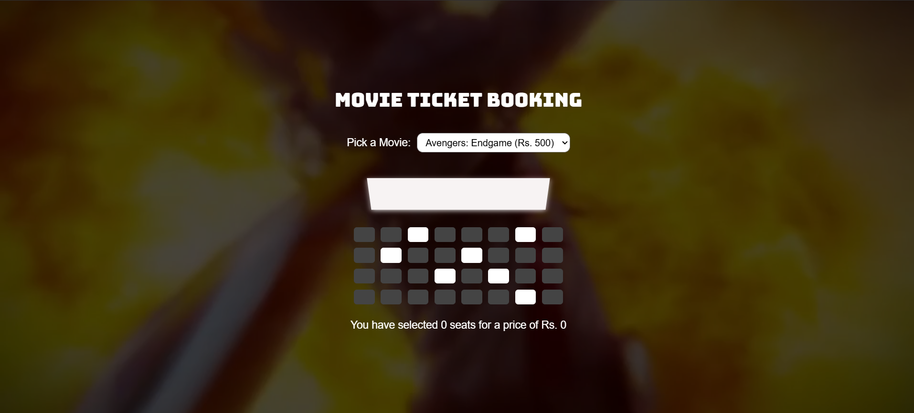

# Movie Ticket Booking Website

A responsive movie ticket booking application built using **HTML**, **CSS**, and **JavaScript**.  
Features a full-screen background video with a dark overlay for a cinematic look.

## Preview
click to view : https://dragindiana8.github.io/Movie_Ticket_Booking/

## Features

- 🎬 **Movie Selection** – Pick from available movies with dynamic ticket pricing.
- 🪑 **Seat Booking System** – Select available seats and view total cost instantly.
- 📱 **Fully Responsive** – Works smoothly on desktops, tablets, and mobile devices.
- 🎥 **Background Video** – Marvel-themed looping video with a dark overlay for readability.
- 💾 **Local Storage** – Saves selected seats and movie choice for page reloads.

## Technologies Used

- **HTML5** – Structure and layout.
- **CSS3** – Styling, responsiveness, and dark overlay.
- **JavaScript (ES6)** – Seat selection, pricing, and local storage.
- **Google Drive / External Hosting** – For background video streaming.
